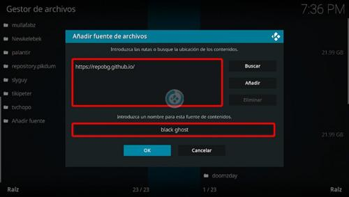

# Instalación del Addon Horus y Acestream en Kodi

## Instalación del Addon Horus

1. Abrimos **Kodi**.

2. Nos ubicamos en **Ajustes** _(icono del engranaje)_.

   

3. Seleccionamos **Administrador de archivos**.

   

4. Elegimos la opción **Añadir fuente**.

   

5. En la URL escribimos:  
   **https://mzoyo.github.io/FireTv-Addons/resources**  
   En el nombre colocamos: **RESOURCES** y damos **OK**.

   

6. Regresamos al menú principal y seleccionamos **Complementos**.

   

7. Hacemos clic en **Complementos** _(icono de la caja)_.

   

8. Elegimos **Instalar desde archivo zip**.

   

9. Seleccionamos la fuente **RESOURCES**.

   

10. Instalamos el archivo **repository.theblackghost.zip**.

    

11. Esperamos la notificación de **Complemento instalado**.

    

12. Elegimos **Instalar desde repositorio**.

    

13. Seleccionamos **The Black Ghost Repo**.

    

14. Navegamos a **Complementos para programas**.

    

15. Elegimos el addon **Horus**.

    

16. Hacemos clic en **Instalar**.

    

17. Esperamos la notificación de **Complemento instalado**.

    

---

## Configuración de Acestream en Fire TV

1. Descargamos e instalamos la APK desde la siguiente URL:  
   **<https://mzoyo.github.io/FireTv-Addons/resources/AceStream.apk>**

2. Abrimos **Acestream**.

   

3. Nos dirigimos al icono con los **tres puntos** y seleccionamos **Ajustes**.  
   _(No es necesario registrarse)_

   

4. Elegimos **Ajustes de motor**.

   

5. Configuramos el búfer:

   - **Búfer VOD, s**: 10
   - **Búfer vivo, s**: 60

   

6. En **Jugador seleccionado**, colocamos **Ace Player**.

   

7. Regresamos al menú principal de **Fire TV** y abrimos **Kodi**.

8. Vamos a **Add-ons** > **Add-ons de programas** > **Horus** > **Ajustes**.  
   Activamos **Reproductor externo** y damos **OK**.

   

9. Probamos seleccionando **Reproducir identificador** en **Horus**.  
   Si todo funciona correctamente, el canal abrirá sin problemas.

   

10. ¡Listo! El tutorial de instalación de **Acestream en Fire TV** habrá concluido exitosamente.

---

## Instalación del Addon Black Ghost

1. Abrimos **Kodi** y regresamos al menú principal y seleccionamos **Complementos**.

   

2. Hacemos clic en **Complementos** _(icono de la caja)_.

   

3. Elegimos **Instalar desde repositorio**.

   

4. Seleccionamos **The Black Ghost Repo**.

   

5. Elegimos **Complementos para video** > **Black Ghost**.

   

6. Instalamos y aceptamos las dependencias.

   

7. Esperamos la notificación de **Complemento instalado**.

   

8. Volvemos al menú complementos y accedemos a **Configuración** del addon **Black Ghost** (dandole a las 3 rayitas):

   

9. Seleccionamos **Predef.** o **Por defecto** y activamos **BlackLove Turbo** y damos **OK**.

   

10. Entramos al addon **Black Ghost** y seleccionamos **INGRESAR AL ADDON**.

11. Ingresamos el código necesario para usar el addon.  
    _(Obtén el código desde el [grupo de Telegram](https://t.me/BGaddon).)_

    

12. Explora las secciones disponibles.

    

13. ¡Listo! El addon **Black Ghost en Kodi** estará instalado correctamente.

---

## **¡Listo!**

Has configurado **Black Ghost** y **Acestream** correctamente en tu Fire TV Stick.

[⬅️ Paso Anterior](step1-kodi.md) | [Paso Siguiente ➡️](step-3-daddylive.md)
