Los pasos para realizar la instalación son los siguientes:

1\. Abrimos **Kodi**

2\. Nos dirigimos a **Ajustes** _(icono de engranaje)_

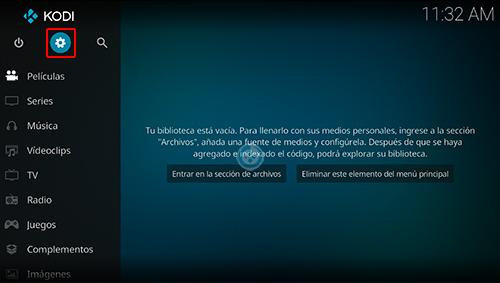

3\. **Administrador de archivos**

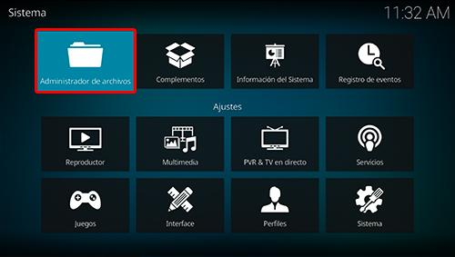

4\. **Añadir fuente**

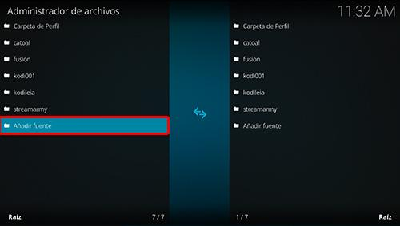

5\. En la ULR colocamos **https://team-crew.github.io/** y nombre **thecrew** damos **OK**

_Si deseas descargar el archivo zip del addon puedes colocar la URL en cualquier navegador._

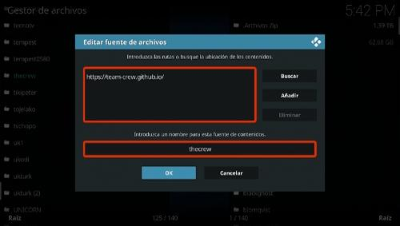
6\. Regresamos al menú principal y seleccionamos **Complementos**

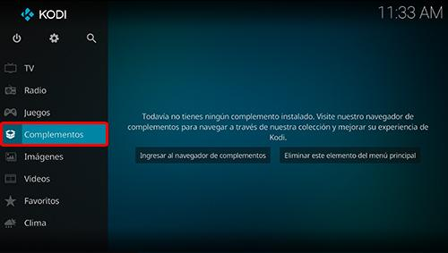
7\. **Complementos** *(icono de la caja)*

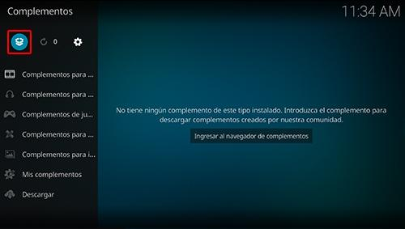

8\. **Instalar desde archivo zip**

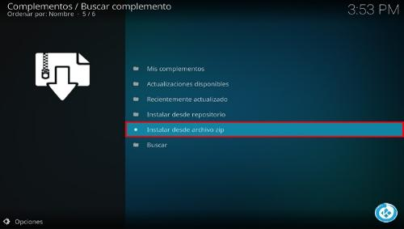
9\. **thecrew**

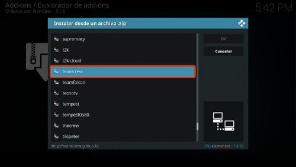

10\. **repository.thecrew-x.x.x.zip**

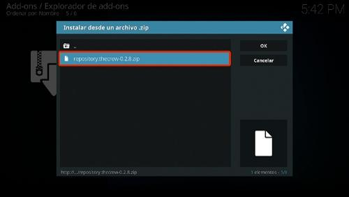

11\. Esperamos la notificación **Complemento instalado**

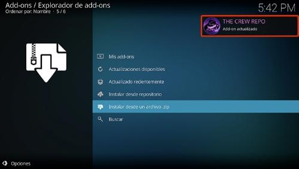
12\. **Instalar desde repositorio**

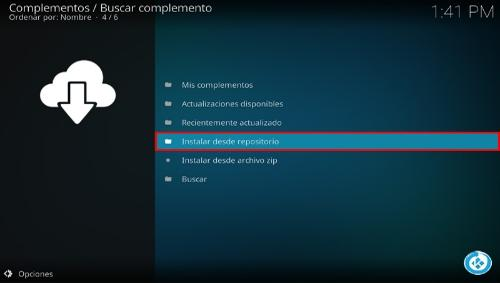
13\. **THE CREW REPO**

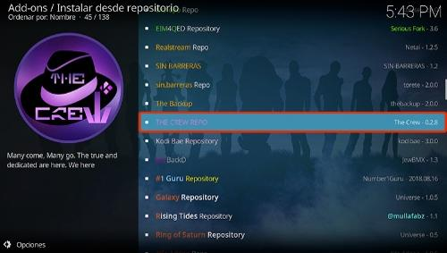

14\. **Complementos para video**

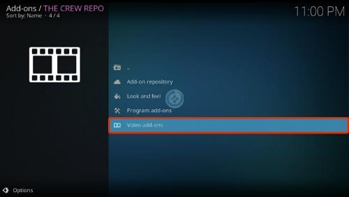

15\. **Daddylive**

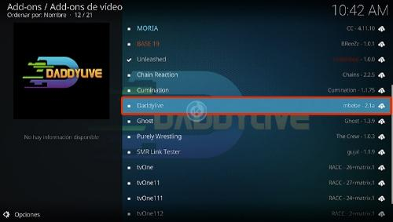

16\. **Install**

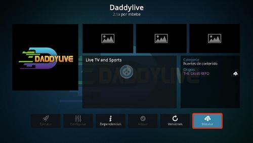

17\. Esperamos la notificación **Complementos activado**

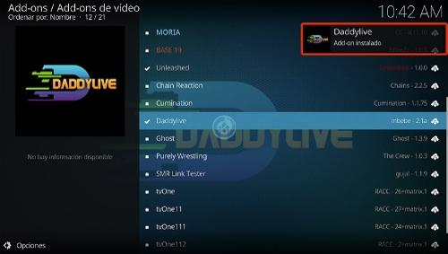

18\. Regresamos al menú de **Complementos** y seleccionamos **Complementos para video** > **Daddylive**

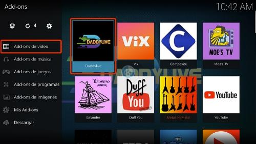

19\. Ahora podremos todas las secciones disponibles dentro del addon **Daddylive**

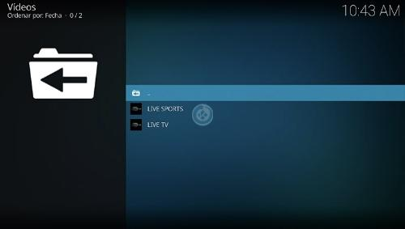

20\. ¡Listo! El addon **Daddylive en Kodi** habrá quedado instalado correctamente.

[⬅️ Paso Anterior](step2-acestream.md)
